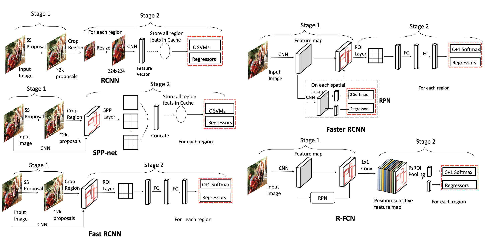
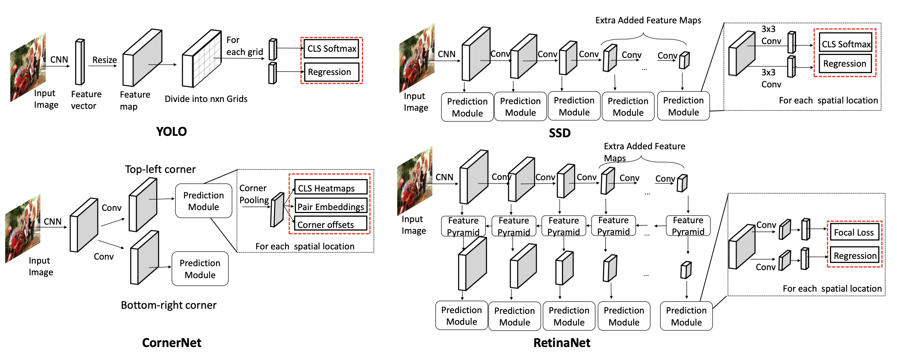
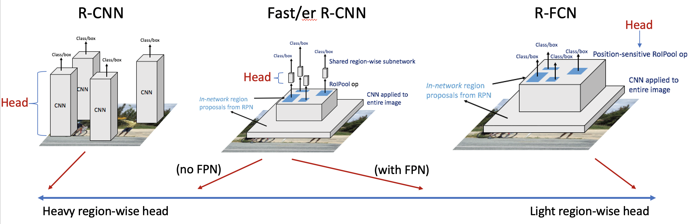
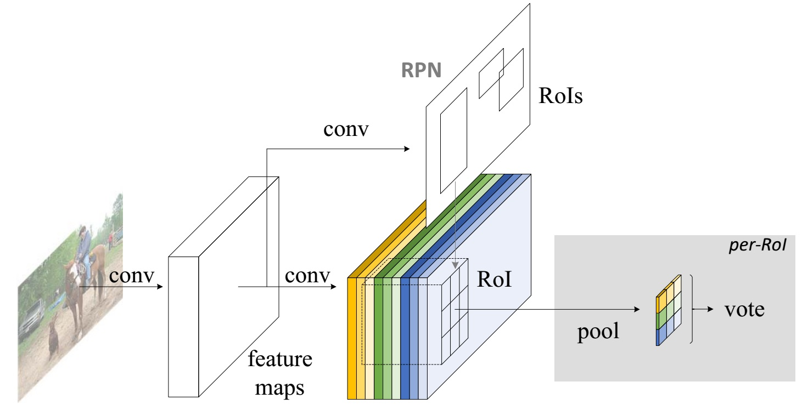
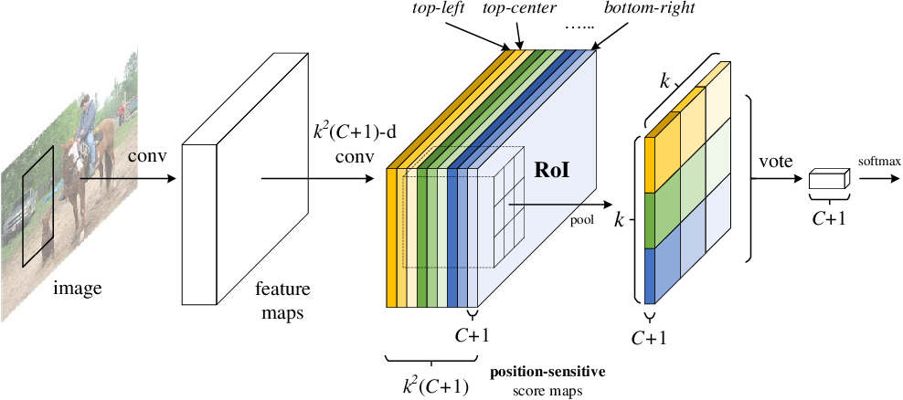
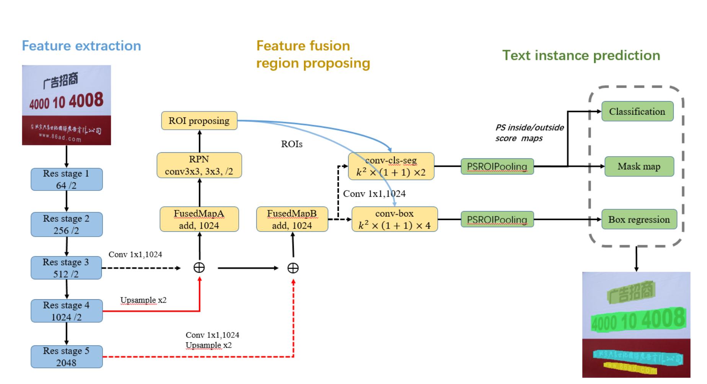

# Fused Text Segmentation Networks for Multi-oriented Scene Text Detection

## Yuchen Dai, Zheng Huang, Yuting Gao, Youxuan Xu, Kai Chen, Jie Guo, Weidong Qiu

[Browse](https://arxiv.org/pdf/1709.03272.pdf)

```latex
@article{dai2017fused,
   title={Fused Text Segmentation Networks for Multi-oriented Scene Text Detection},
   ISBN={9781538637883},
   url={http://dx.doi.org/10.1109/ICPR.2018.8546066},
   DOI={10.1109/icpr.2018.8546066},
   journal={2018 24th International Conference on Pattern Recognition (ICPR)},
   publisher={IEEE},
   author={Dai, Yuchen and Huang, Zheng and Gao, Yuting and Xu, Youxuan and Chen, Kai and Guo, Jie and Qiu, Weidong},
   year={2018},
   month={Aug}
}
```

### Pipeline

| Receipt detection | Receipt localization | Receipt normalization | Text line segmentation | Optical character recognition | Semantic analysis |
|:-----------------:|:--------------------:|:---------------------:|:----------------------:|:-----------------------------:|:-----------------:|
| ❌                 | ❌                    | ❌                     | ✔️                     | ❌                             | ❌                 |

#### Text line segmentation

* > resnet-101 backbone

* PSROIPooling instead of ROIPooling + FC layers (faster inference time)

  

  source: [https://arxiv.org/pdf/1908.03673.pdf](https://arxiv.org/pdf/1908.03673.pdf)

* 
  source: [https://arxiv.org/pdf/1908.03673.pdf](https://arxiv.org/pdf/1908.03673.pdf)

* 
  source: http://deeplearning.csail.mit.edu/instance_ross.pptx

* 
  source: [https://joshua19881228.github.io/2016-05-23-RFCN/](https://joshua19881228.github.io/2016-05-23-RFCN/)

* 
  source: [https://www.semanticscholar.org/paper/R-FCN%3A-Object-Detection-via-Region-based-Fully-Dai-Li/b724c3f7ff395235b62537203ddeb710f0eb27bb](https://www.semanticscholar.org/paper/R-FCN%3A-Object-Detection-via-Region-based-Fully-Dai-Li/b724c3f7ff395235b62537203ddeb710f0eb27bb)

* PSRoi Inside/Outside Pooling - [more here](https://towardsdatascience.com/review-fcis-winner-in-2016-coco-segmentation-instance-segmentation-ee2d61f465e2)

* smooth-L1

* > Ground truth of each text instance is presented by bounding boxes and masks

* > The post-processing part includ

* > After NMS, we generate a minimum quadrilateral for each text instance covering the mask

* > Standard NMS computes IOU among bounding boxes

* > Mask-NMS mainly changes bounding box IOU computation to so-called mask-maximum-intersection (MMI)

* > Maximum intersection over the mask areas are used to replace original IOU for the reason that detections may easily involve line-level and word-level text instances simultaneously at the same line

### Notes

* 

* > multi-oriented text detection from an instance aware segmentation perspective

* "Fused Text Segmentation Networks"

* > Ground truth of each text instance is presented by bounding boxes and masks
