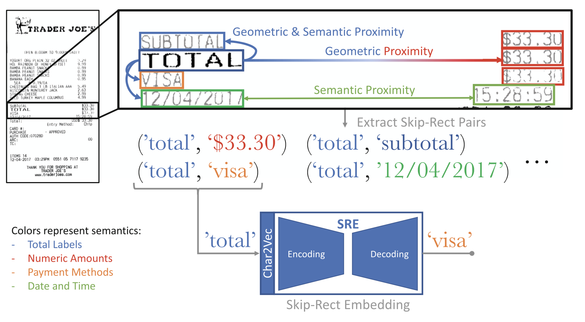
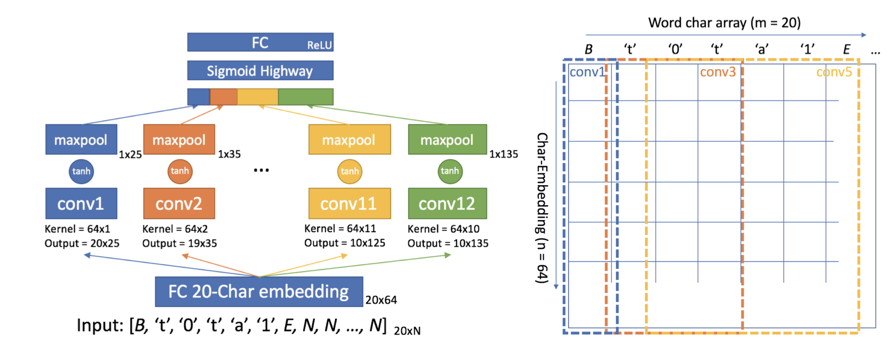
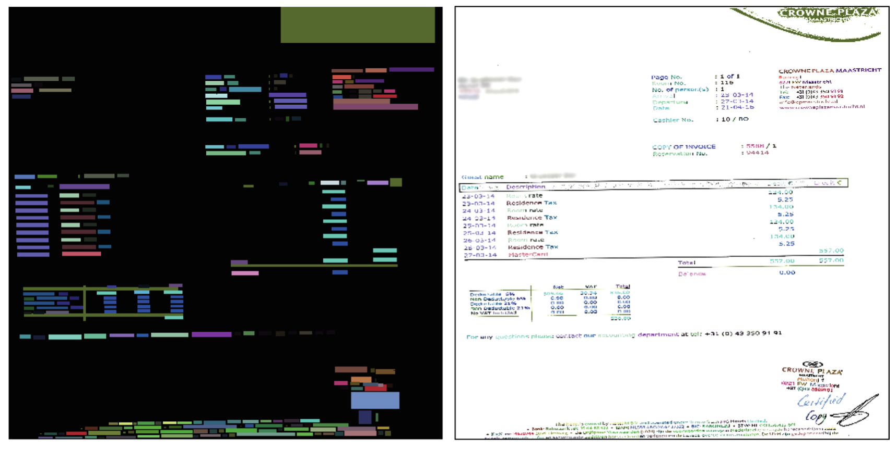
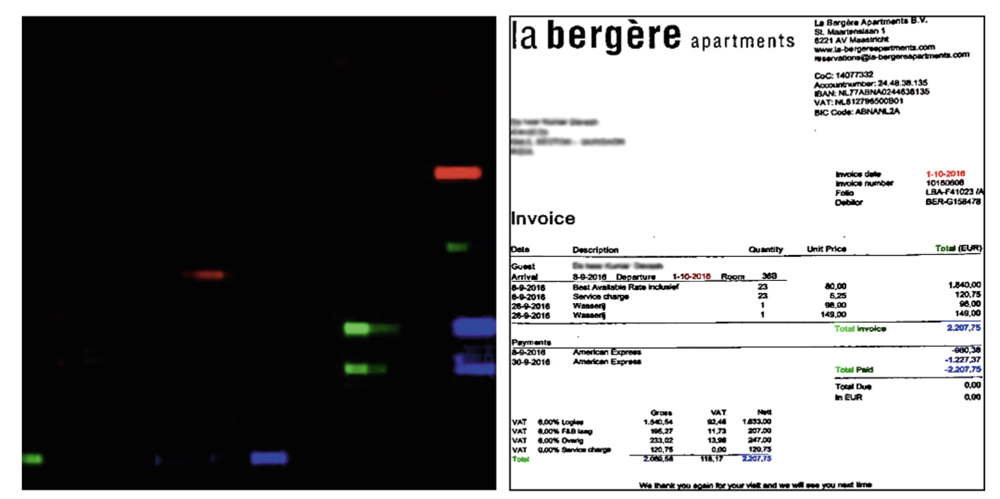
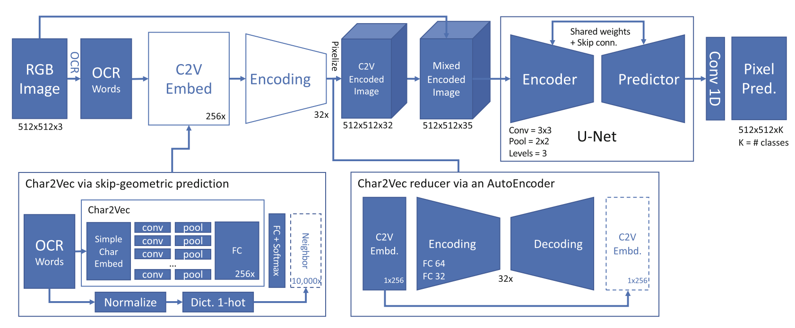

# Visual-Linguistic Methods for Receipt Field Recognition

## Rinon Gal, Nimrod Morag, Roy Shilkrot

[Browse](https://link.springer.com/chapter/10.1007/978-3-030-20890-5_35)

```latex
@inbook{gal2018visual,
author = {Gal, Rinon and Morag, Nimrod and Shilkrot, Roy},
year = {2019},
month = {06},
pages = {542-557},
title = {Visual-Linguistic Methods for Receipt Field Recognition},
isbn = {978-3-030-20889-9},
doi = {10.1007/978-3-030-20890-5_35}
}
```

### Pipeline

| Receipt detection | Receipt localization | Receipt normalization | Text line segmentation | Optical character recognition | Semantic analysis |
|:-----------------:|:--------------------:|:---------------------:|:----------------------:|:-----------------------------:|:-----------------:|
| ❌                 | ❌                    | ❌                     | ❌                      | ❌                             | ✔️                |

#### Semantic analysis

- Fields extracted:

  - Total price,
  - date

- > Skip-Gram method, which models semantic meaning using the company of the word, can be used geometrically to learn the relationship between sums (e.g “$NN.NN”) and their neighboring labels (e.g. “Total:”)

- > “Skip-Rect Embedding” (SRE): a descriptor that jointly learns the relationship between textual format and spatial proximity in the OCR-enhanced image

- > deep network used to analyze the embedded document is relieved of the task of learning the meanings and relationships of visual glyphs and characters

- > character-level embedding (Char2Vec) for the words in the document, which is able to look past OCR mistakes

- > a method for extracting information from receipt and invoice images by (1) creating a robust character-level embedding from OCR results, (2) creating an image overlayed with the embedding data and (3) using this embedding image to jointly learn spatial and linguistic features.

- Components:

  - > A Char2Vec network for generating word level embeddings from their character level content and geometric context

    > the input word vs. a neighboring target word in a pair, and seek to find an embedding that encodes this pair-wise relationship

    > Time-Delayed Convolutional Network

    > sigmoid highway layer

    > 256-dimensional embedding vector of the input word

    > standard auto-encoder network was implemented in order to provide dimensionality reduction for our embeddings here smaller representations are desired

    

    

    

  - > A network for generating a heat-map of label probabilities using a base image overlayed with word-embedding data as generated by the Char2Vec network

    > For each word read by the OCR, the 256-dimensional embedding vector is extracted, the auto-encoder is used to reduce it to 32 dimensions, and then every pixel within that word’s bounding rectangle is ‘colored’ by the values of the embedding.

    > input image fed into the U-Net architecture is a 35-layer ‘RGB-Embedding’ image

    

  - > An ‘inverted softmax’ linear classifier for determining the best candidate word to match for each label, based on the heat-map generated by the network and a set of hand-crafted features

    > Receipt images can often contain multiple instances of each field

    > learning to provide a score for each field (e.g. the TOT.AMT. ), for each detected word in the OCR’ed receipt image

    > ‘reversed’ softmax problem: instead of looking at each OCR output and giving it a field designation (“the most likely field for the OCR word ‘T0t41’ is the TOT.AMT.”) we pick a field and label it with OCR candidates (“the most likely word for the TOT.AMT. field is ‘T0t4l’ ”)

    > For each OCR’ed word j we compose a descriptor vector xj, which consists of some hand-crafted features such as: “is numeric?”, “number of decimal dots”, “length in characters”, “y coordinate in the image” etc., along with features derived from the field-tagger heat maps, such as the total, mean and standard deviation of field confidences within each word’s bounding rectangle.

### Notes

* 
* > a strong indicator of semantic meaning for words and data in a receipt document are the immediate neighbors
* > linguistic models for semantic analysis can be adapted geometrically to overcome problems arising in sparse structured documents
* > a receipt image can be aided by finding the semantic meaning of words
* > Character-level embedding is especially useful when inter-character relationships are important, for example in language identification and part-of-speech tagging
* Pipeline:
  * Pre-processing: Image Analysis
  * OCR
  * Skip-Rect Embedding
  * OCR Enhancement
  * Field Tagging Information Extraction
