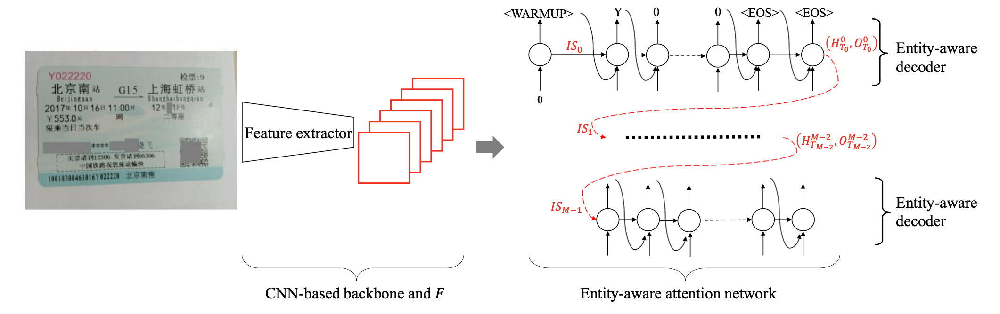
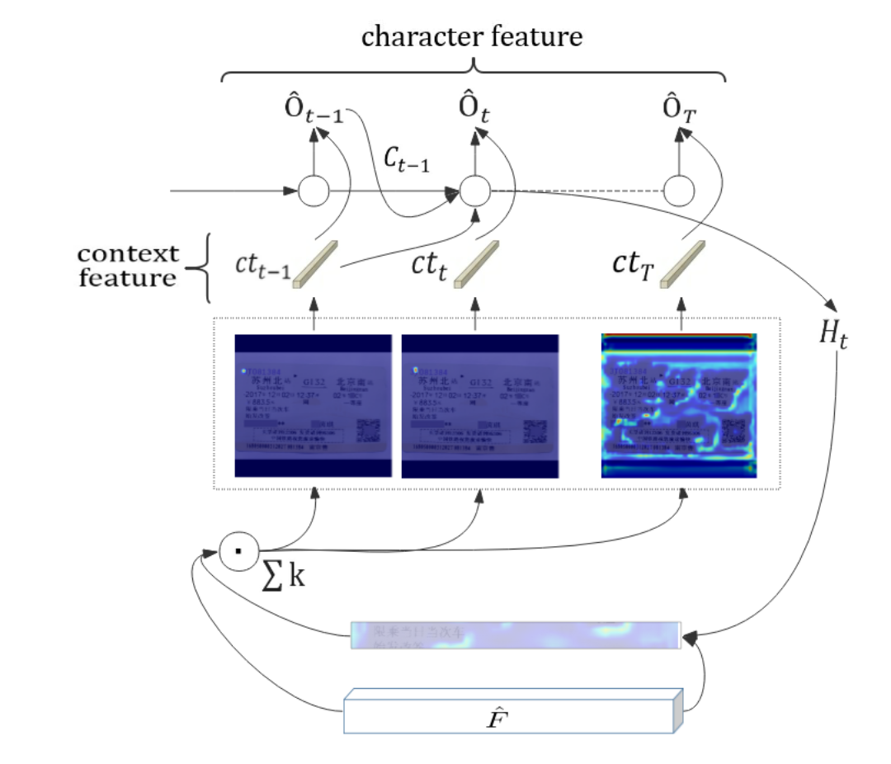

# EATEN: Entity-aware Attention for Single Shot Visual Text Extraction

## He Guo, Xiameng Qin, Jiaming Liu, Junyu Han, Jingtuo Liu, Errui Ding

[Browse](url)

### Pipeline

| Receipt detection | Receipt localization | Receipt normalization | Text line segmentation | Optical character recognition | Semantic analysis |
|:-----------------:|:--------------------:|:---------------------:|:----------------------:|:-----------------------------:|:-----------------:|
| ❌                 | ❌                    | ❌                     | ❌                      | ❌                             | ✔️                |

#### Semantic analysis

- Fields extracted:
  - train ticket:
    - Ticket number,
    - Starting station,
    - Train number,
    - Destination station,
    - Date,
    - Ticket rates,
    - Seat category,
    - Name
  - passport:
    - passport number,
    - name,
    - gender,
    - birth date,
    - birth place,
    - issue place,
    - expiry date
  - business card:
    - telephone
    - postcode,
    - mobile,
    - url,
    - email, 
    - fax,
    - address,
    - name,
    - title,
    - company
- > we design an entity-aware attention network with multiple decoders and state transition between contiguous decoders so that the EoIs can be quickly located and extracted without any complicated post-process.
- > The CNN-based backbone aims to extract high-level visual features from
  > images, and the entity-aware attention network learns entities layout of images automatically and decodes the content of predefined EoIs by entity-aware decoders
  
  
- > Inception v3 as the backbone
- > To build the semantic relations between the neighboring EoIs, we employ the last state of previous decoder to initialize the current decoder. We also use initial state warm-up to boost the performance of attention mechanism.
- > In each decoding step, the entity-aware decoder firstly uses entity-aware attention mechanism to obtain the corresponding context feature. The context feature, combined with previously predicted character, is further fed into an LSTM unit as input. And then the LSTM will update context feature and predict current character.
  
  

### Notes

* Limitation - fixed number of "decoders", so can't work with varying number of items on receipt
* > end-to-end trainable framework instead of multi-stage procedures
* > EATEN has no explicit text recognition and uses the entity-aware decoder to decode the corresponding EoIs directly. No lexicon is used in this work.
* > EATEN is efficiently trained without bounding box and full text annotations, and directly predicts target entities of an input image in one shot without any bells and whistles.
