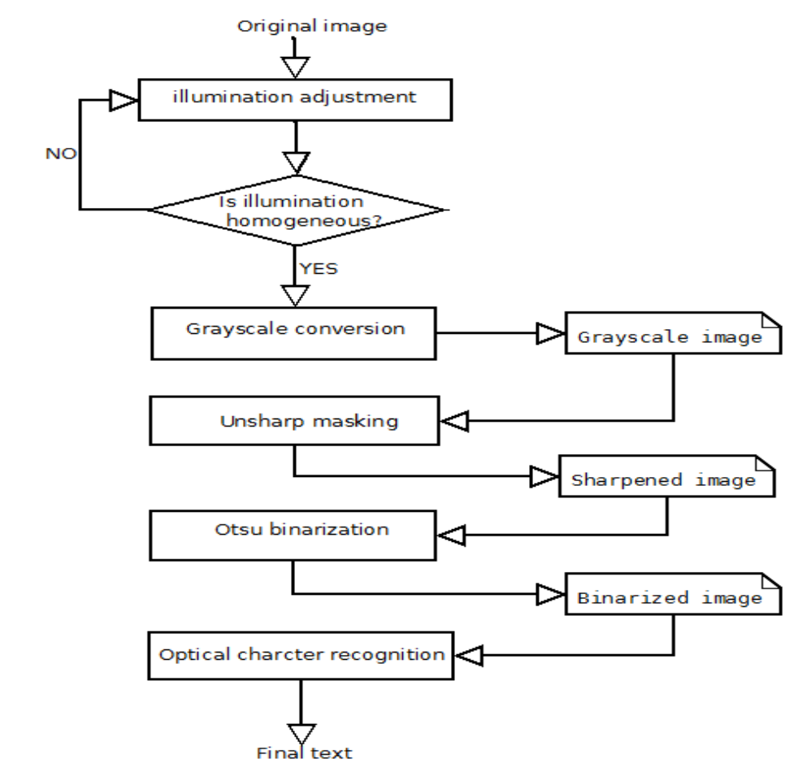
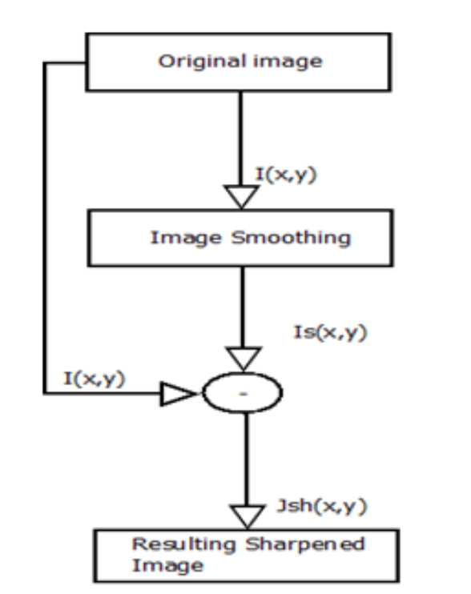

# OCR accuracy improvement on document images through a novel pre-processing approach

## Abdeslam El Harraj, Naoufal Raissouni

[Browse](https://arxiv.org/pdf/1509.03456.pdf)

```latex
@article{article,
author = {Harraj, Abdeslam and Raissouni, Naoufal},
year = {2015},
month = {09},
pages = {},
title = {OCR Accuracy Improvement on Document Images Through a Novel Pre-Processing Approach},
volume = {6},
journal = {Signal & Image Processing : An International Journal},
doi = {10.5121/sipij.2015.6401}
}
```


### Pipeline

| Receipt detection | Receipt localization | Receipt normalization | Text line segmentation | Optical character recognition | Semantic analysis |
|:-----------------:|:--------------------:|:---------------------:|:----------------------:|:-----------------------------:|:-----------------:|
| ❌                 | ❌                    | ✔️                    | ❌                      | ❌                             | ❌                 |

#### Receipt normalization

* > Illumination adjustment, grayscale conversion, Un-sharp masking and optimized adaptive thresholding for binarization
  
  

* Illumination adjustment - CLAHE as a powerful contrast enhancement 
  
  * Brightness Equalization - CLAHE is based on Adaptive Histogram Equalization (AHE). CLAHE can limit the noise whereas enhancing the contrast
  * Brightness estimation - Y’UV is more suitable for our case to estimate the brightness

* Grayscale conversion

* Un-sharp masking
  

* Otsu thresholding - Cleaning and whitening document background

#### Notes

* > nonparametric and unsupervised method to compensate for
  > undesirable document image distortions aiming to optimally improve OCR accuracy
* 
