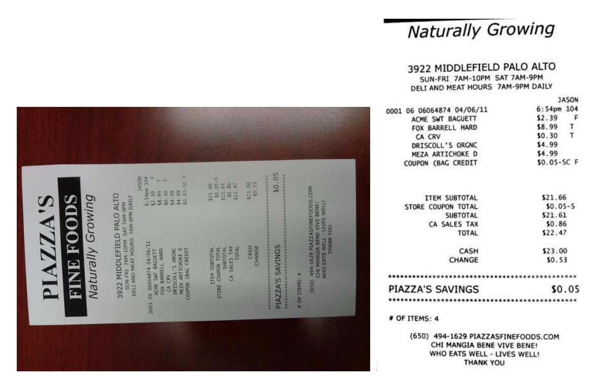
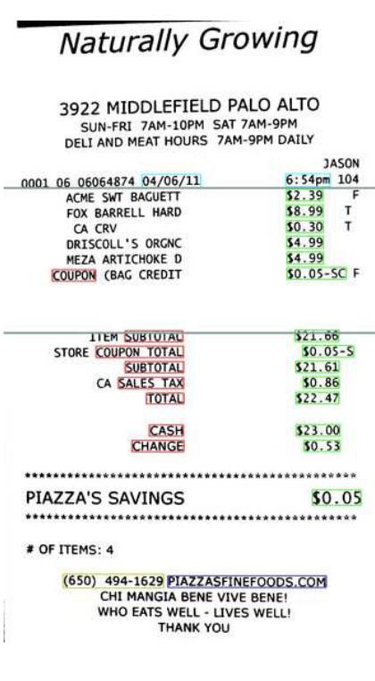
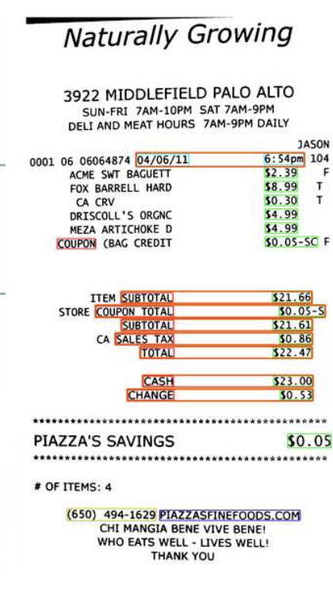

# Receipts2Go: The Big World of Small Documents

## Bill Janssen, Eric Saund, Eric A. Bier, Patricia Wall, Mary Ann Sprague

[Browse](http://www.saund.org/papers/2012-janssen-etal-receipts2go-big-world.pdf)

```latex
@inproceedings{janssen2012receipts,
author = {Janssen, Bill and Saund, Eric and Bier, Eric and Wall, Patricia and Sprague, Mary Ann},
year = {2012},
month = {09},
pages = {121-124},
title = {Receipts2Go: The big world of small documents},
doi = {10.1145/2361354.2361381}
}
```

### Pipeline

| Receipt detection | Receipt localization | Receipt normalization | Text line segmentation | Optical character recognition | Semantic analysis |
|:-----------------:|:--------------------:|:---------------------:|:----------------------:|:-----------------------------:|:-----------------:|
| ❌                 | ✔️                   | ✔️                    | ❌                      | ❗                             | ✔️                |

#### Receipt normalization

* Orientation detection and correction
  
  > Since the resolution of input images can vary widely, we need to dynamically determine the likely characters on the page so that their sizes can be measured. We do this by applying a clustering algorithm
  > to the connected components of a simple thresholded binary version of the image, which generates two or more clusters of decreasing size. The largest of these clusters is typically noise – speckles and dust on the image. The second largest is taken as the cluster of character images. We measure the average width and height of the components in this cluster and use that measurement as the average width and height of the characters on the image.
  
  > our orientation detection need only recognize “sideways” images and correct them
  
  > uses the extracted connected components which represent characters, and calculates the average aspect ratio of those components. If the average is “wider” than it is “tall”, the image is taken to be “sideways”, and rotated by 90 degrees

* Supersampling:
  
  > We check to see if the average height of character connected components is less than some limit and if so, supersample the image by 2x to increase the average character size

* Deskewing:
  
  > measures the skew from horizontal of the document image, using a standard Hough transform approach

* Background removal and illumination normalization:
  
  > we remove the background and attempt to normalize the illumination across the foreground content of the image. This is done by an iterative technique that estimates and interpolates the color distribution of light background across the image, and then applies a combination of high-pass filtering and distance measures on the hue-saturation-brightness values of individual pixels

* Binarization
  
  > binarized using a simple thresholding technique

#### Receipt localization

* > crop the image to cover the area in which the “character-sized” connected components were found
  
  

#### Optical character recognition

- > through a commercial OCR system
- possibly FireWorX OCR

#### Semantic analysis

- Fields extracted:
  
  - date
  - time
  - total price
  - tax price
  - phone number
  - url

- > based on text features and certain geometric relationships between those features

- > applying context-free regular-expression patterns to identify high-value information fragments, which we call “entities” - telephone numbers, dates, URLs, names and addresses, currency amounts, email addresses, and credit-card numbers

- > look for certain key phrases like “TOTAL AMOUNT” or “DATE PAID” which help to disambiguate other entities

- > “DATE PAID” would be a “date” key phrase

- > a regular expression engine which supports “fuzzy” matching [6] for finding these entities

- > This allows us to specify regular expressions which match sub-strings within a specified Levenshtein distance
  
  

- > We next group each key phrase entity with another entity of the proper type

- > The relationships currently used are “RightOf ”, “LeftOf”, “Below”, and “Above”. For instance, we use a timestamp as a “date” key phrase entity, and require it to have a “RightOf” relationship with any date it applies to.

- > amount” key phrases that indicate a total are required to appear “Above” or “LeftOf” a currency amount entity in order to be associated with it.

- > we also need to identify the region of the receipt containing the line items

- > first identify the topmost currency amount entity, and use the top of its bounding box as the top of our list items region. We then look for the first currency amount entity below it that is also tagged with an amount keyword, such as “total” or “subtotal”. The top of that entity is used as the bottom of the list items region.
  
  

### Notes

* Rule based, tries to build rules based on keywords and spatial co-occurence
