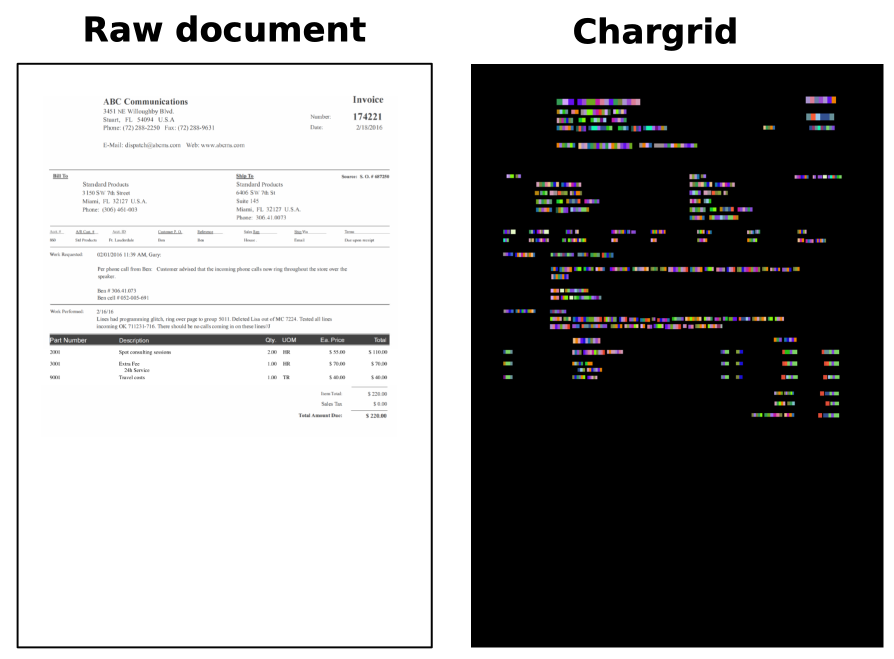
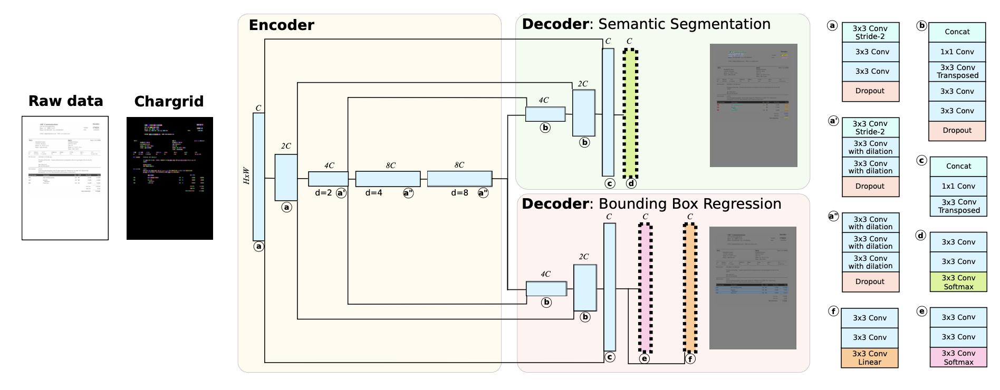
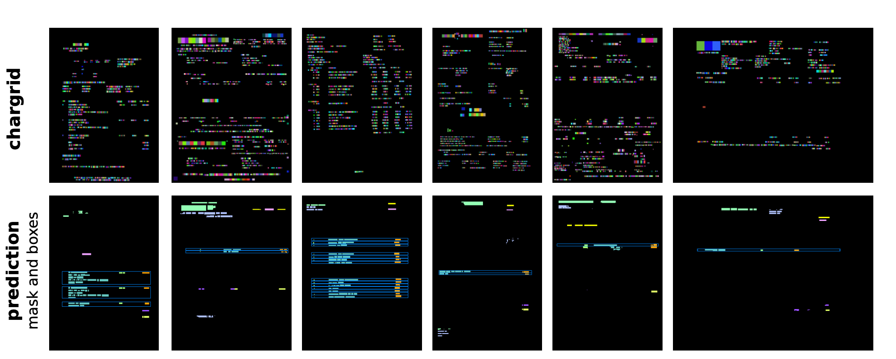

# Chargrid: Towards Understanding 2D Documents

## Anoop Raveendra Katti, Christian Reisswig, Cordula Guder, Sebastian Brarda, Steffen Bickel, Johannes Höhne, Jean Baptiste Faddoul

[Browse](https://arxiv.org/pdf/1809.08799)

```latex
@unknown{katti2018chargrid,
author = {Katti, Anoop and Reisswig, Christian and Guder, Cordula and Brarda, Sebastian and Bickel, Steffen and Höhne, Johannes and Faddoul, Jean},
year = {2018},
month = {09},
pages = {},
title = {Chargrid: Towards Understanding 2D Documents}
}
```

### Pipeline

| Receipt detection | Receipt localization | Receipt normalization | Text line segmentation | Optical character recognition | Semantic analysis |
|:-----------------:|:--------------------:|:---------------------:|:----------------------:|:-----------------------------:|:-----------------:|
| ❌                 | ❌                    | ❌                     | ❌                      | ❗                             | ✔️                |

#### Optical character recognition

- Tesseract v4

#### Semantic analysis

- Fields extracted:
  
  - Invoice Number,
  - Invoice Date,
  - Invoice Amount,
  - Vendor Name,
  - Vendor Address,
  - Line-items:
    - Line-item Description
    - Line-item Quantity
    - Line-item Amount

- > A chargrid can be constructed from character boxes, i.e., bounding boxes that each surround a single character somewhere on a given document page. This positional information can come from an optical character
  > recognition (OCR) engine
  
  

- > The advantage of the new chargrid representation is twofold: (i) we directly encode a character by a single scalar value rather than by a granular
  > collection of grayscale pixels as is the case for images, thus making it easy for the subsequent document analysis algorithms to understand the doc-
  > ument, and (ii), because the group of pixels that belonged to a given character are now all mapped to the same constant value, we can significantly downsample the chargrid representation without loss of any information.

- > We use the 1-hot encoded chargrid representation g ̃ as input to a fully convolutional neural network to perform semantic segmentation on the chargrid and predict a class label for each character-pixel on the document. As there can be multiple and an unknown number of instances of the same class, we further perform instance segmentation. This means, in addition to predicting a segmentation mask, we may also predict bounding boxes using the techniques from object detection. This allows
  > the model to assign characters from the same segmentation class to distinct instances.
  
  

- VGG encoder

- > To extract the values for each field, we collect all characters that are classified as belonging to the corresponding class. For line-items, we further group the characters by the predicted item bounding boxes.
  
  

### Notes

* > Instead of serializing a document into a 1D text, the proposed method, named chargrid, preserves the spatial structure of the document by representing it as a sparse 2D grid of characters.
* > the model predicts a segmentation mask with pixel-level labels and object bounding boxes to group multiple instances of the same class
* > we collected manual annotations with bounding boxes around the fields of interest
* > The chargrid allows models to capture 2D relationships between characters, words, and larger units of text.
