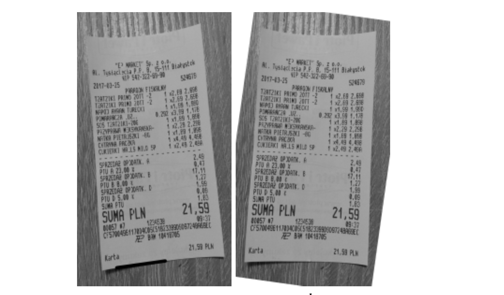
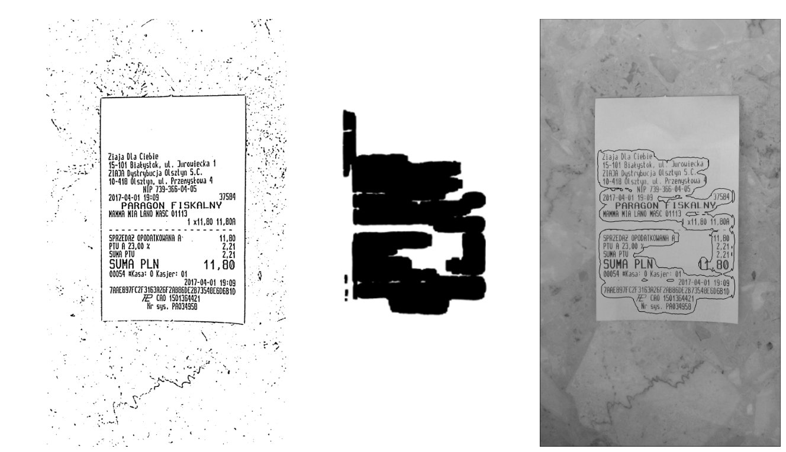
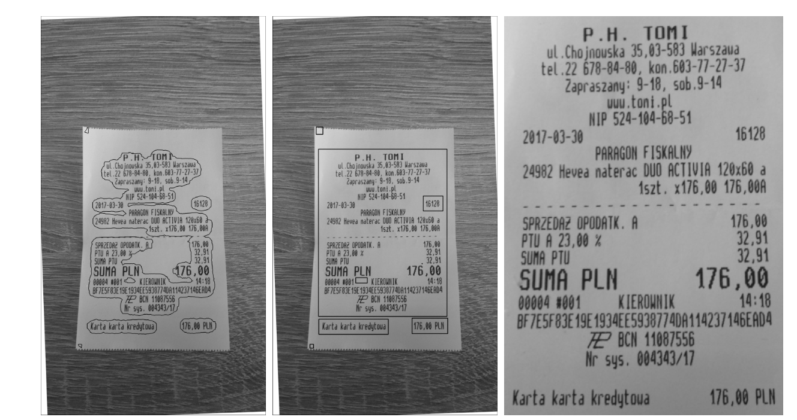
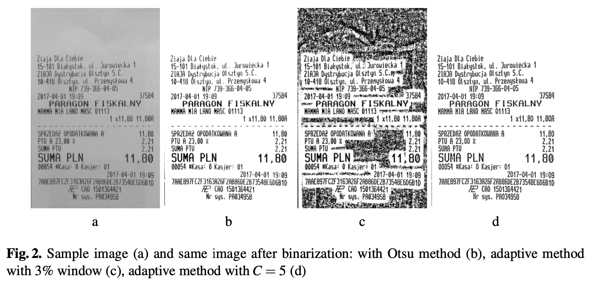

# Preprocessing Photos of Receipts for Recognition

## Wojciech Korobacz, Marek Tabędzki

[Browse](http://yadda.icm.edu.pl/yadda/element/bwmeta1.element.baztech-36fa8eb4-f202-4c2c-b5b3-c8af0cebf3d8/c/preprocessing_korobacz_advances_14_2018.pdf)

### Pipeline

| Receipt detection | Receipt localization | Receipt normalization | Text line segmentation | Optical character recognition | Semantic analysis |
|:-----------------:|:--------------------:|:---------------------:|:----------------------:|:-----------------------------:|:-----------------:|
| ❌                 | ✔️                   | ✔️                    | ❌                      | ❗                             | ❌                 |

#### Receipt localization

* By text outline detection:
  
  * Grayscale conversion
  
  * smoothing and histogram equalization
  
  * Pre-rotating the image:
    
    * First method (THIS WAS USED HERE)
      
      * Binarization with Gradient method (mathematical morphology)
      
      * Hough transform - to make text lines horizontal
    
    * Second method (ALSO TESTED):
      
      * Binarization - adaptive thresholding
      
      * Denoising
      
      * Vertical histogram from -10 to 10 degrees
    
    
  
  * Detecting the entire text outline and marking it in the image:
    
    * One of:
      
      * Canny's edge detection - BETTER
      
      * high-pass filter based on Sobel operator
    
    * morphological operation of erosion
    
    
  
  * Image cropping:
    
    * find all the contours based on the input image
    
    * the found outlines were filtered out
    
    * rectangles escribed on the given contours were found
    
    * the rectangle escribed on the whole set of contours was searched
    
    * finds the minimum rectangle containing a set of rectangles
    
    

#### Receipt normalization

* Thinning - K3M skeletonization algorithm - tested but not used, because gave worse results with stock OCR

#### Optical character recognition

- ABBYY FineReader

### Notes

* > The authors had mainly difficult cases in mind – photos taken freehand in unfavorable lighting conditions.
* > inhomogeneous lighting conditions, cropping, different angles of images taken, non-linear distortions and sharpness of images
* > The following characteristics of the samples were considered:
  > - Cropping – whether the entire receipt is visible, how much background is in the picture,
  > 
  > - Lighting – it can be artificial or natural, strong or weak, shadows can be seen on the receipt,
  > 
  > - Sharpness – whether the photo is sharp or blurred,
  > 
  > - Angle of rotation – how much the photo deviates from the vertical position,
  > 
  > - Folds – the receipt may be curled or folded.
* Binarization methods tested:
  * Otsu method
    * > Otsu’s global method copes well with clear, sharp images with a good lighting
  * 2 Adaptive methods:
    * > For the first method, the threshold value T is a mean of the pixel intensities in the observation window.
    * > For the second one, it is a weighted sum (cross-correlation with a Gaussian window) of this neighborhood.
    * > In the adaptive methods along with the growing observation window, the text becomes less readable
  * > the histogram equalization, due to the loss of some information, introduced disturbances and caused problems in the binarization. In the case of smoothing, only for low sigma values this has a positive effect on the result.
  * > Comparing visually, the adaptive method with the equal weights in the observation window is the best
  
  
