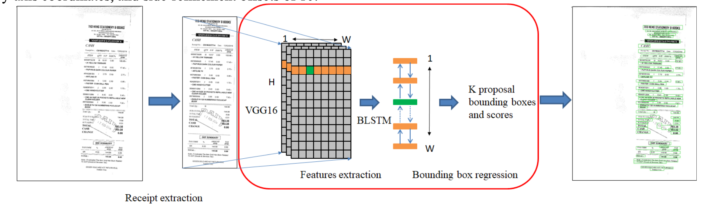
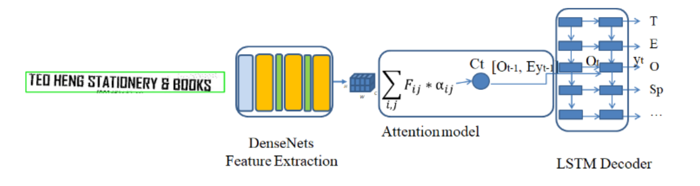

# Deep Learning Approach for Receipt Recognition

## Le Duc, Anh & Pham, Dung & Nguyen, Tuan

[Browse](https://arxiv.org/pdf/1905.12817)

```latex
@article{le2019deep,
   title={Deep Learning Approach for Receipt Recognition},
   ISBN={9783030356538},
   ISSN={1611-3349},
   url={http://dx.doi.org/10.1007/978-3-030-35653-8_50},
   DOI={10.1007/978-3-030-35653-8_50},
   journal={Lecture Notes in Computer Science},
   publisher={Springer International Publishing},
   author={Le, Anh Duc and Pham, Dung Van and Nguyen, Tuan Anh},
   year={2019},
   pages={705–712}
}
```


### Pipeline

| Receipt detection | Receipt localization | Receipt normalization | Text line segmentation | Optical character recognition | Semantic analysis |
|:-----------------:|:--------------------:|:---------------------:|:----------------------:|:-----------------------------:|:-----------------:|
| ❌                 | ✔️                   | ❌                     | ✔️                     | ✔️                            | ❌                 |

#### Receipt localization

* > We propose a simple method by the histograms of the
  > input image on the x-axis and y-axis.
  >
  > (1) We calculate the histogram of the input image on x-
  > axis and y-axis.
  >
  > (2) We determine the largest receipt area on each axis
  > when the histogram is larger than a threshold. Then, we
  > determine the receipt area.

#### Text line segmentation

* > The original CTPN detects horizontally arranged text. The
  > CTPN structure is basically similar to Faster R-CNN, but with
  > the addition of the LSTM layer.
* > (1) VGG16 extract feature from an input receipt. The
  > size of the features is W×H×C.
  >
  > (2) A sliding window on the output feature map is
  > employed. In each row, the sequential windows connected to
  > a Bi-directional LSTM (BLSTM).
  >
  > (3) The BLSTM layer is connected to a 512D fully-
  > connected layer. Then, the output layer predicts text/non-text
  > scores, y-axis coordinates, and side-refinement offsets of 10.
* 

#### Optical character recognition

- > The AED has two main modules: DenseNet for extracting features from a text image and an LSTM combined with an attention model for
  > predicting the output text.
- > The context vector is computed by the attention mechanism.
- 

### Notes

*
