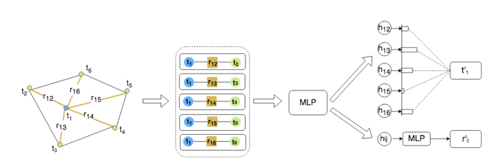
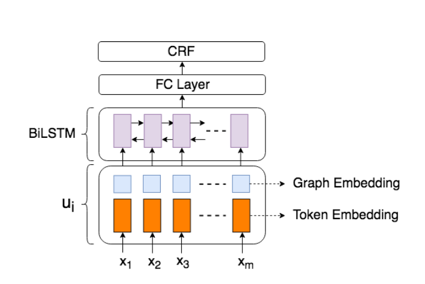
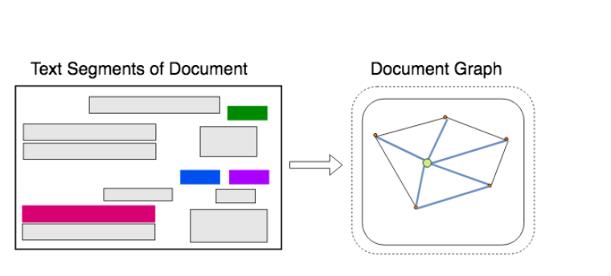

# Graph Convolution for Multimodal Information Extraction from Visually Rich Documents

## Xiaojing Liu, Feiyu Gao, Qiong Zhang, Huasha Zhao

[Browse](https://www.aclweb.org/anthology/N19-2005.pdf)

### Pipeline

| Receipt detection | Receipt localization | Receipt normalization | Text line segmentation | Optical character recognition | Semantic analysis |
|:-----------------:|:--------------------:|:---------------------:|:----------------------:|:-----------------------------:|:-----------------:|
| ❌                 | ❌                    | ❌                     | ❌                      | ❌                             | ✔️                |

#### Semantic analysis

- Fields extracted:
  - VATI:
    - name of buyer
    - name of seller
    - date
    - tax price
    - ...12 more
  - IPR:
    - invoice number
    - vendor name
    - payer name
    - total price
- > The method first computes graph em-
  > beddings for each text segment in the document
  > using graph convolution. The graph embeddings
  > represent the context of the current text segment where the convolution operation combines both
  > textual and visual features of the context. Then
  > the graph embeddings are combined with text em-
  > beddings to feed into a standard BiLSTM for in-
  > formation extraction.
- > this paper introduces explicit edge embeddings into the graph
  > convolution network, which models the rela-
  > tionship between vertices directly.
- > apply self-attention to define convolution on
  > variable-sized neighbors, and the approach is com-
  > putationally efficient since the operation is paral-
  > lelizable across node pairs.
- > first encodes each text segment in the document
  > into graph embedding, using multiple layers of
  > graph convolution. The embedding represents the
  > information in the text segment given its visual and
  > textual context. By visual context, we refer to the
  > layout of the document and relative positions of
  > the individual segment to other segments. Tex-
  > tual context is the aggregate of text information in
  > the document overall; our model learns to assign
  > higher weights on texts from neighbor segments.
  > Then we combine the graph embeddings with text
  > embeddings and apply a standard BiLSTM-CRF model for entity extraction
  
  
- > We model each document as a graph of text seg-
  > ments, where each text segment is
  > comprised of the position of the segment and the
  > text within it. The graph is comprised of nodes
  > that represent text segments, and edges that repre-
  > sent visual dependencies, such as relative shapes
  > and distance, between two nodes.
- > For example, in
  > general, the positions of relevant information are closer in one document, such as the key and value
  > of an entity. Moreover, the shape of the text seg-
  > ment plays a critical role in representing seman-
  > tic meanings. For example, the length of the text
  > segment which has address information is usually
  > longer than that of one which has a buyer name.
  > Therefore, we use edge embedding to encode in-
  > formation regarding the visual distance between
  > two segments, the shape of the source node, and
  > the relative size of the destination node.
- > node embedding encodes textual
  > features, while edge embedding primarily repre-
  > sents visual features.
- > combine graph embeddings with token embed-
  > dings and feed them into standard BiLSTM-CRF
  > for entity extraction.
  
  
- > Word2Vec vectors are used as token embed-
  > dings
  
  

### Notes

* > VRDs can be represented as a graph of text seg-
  > ments (Figure 2), where each text segment is com-
  > prised of the position of the segment and the text
  > within it. The position of the text segment is de-
  > termined by the four coordinates that generate the
  > bounding box of the text.
  
  
* > The problem we address in this paper is to ex-
  > tract the values of pre-defined entities from VRDs
* 
