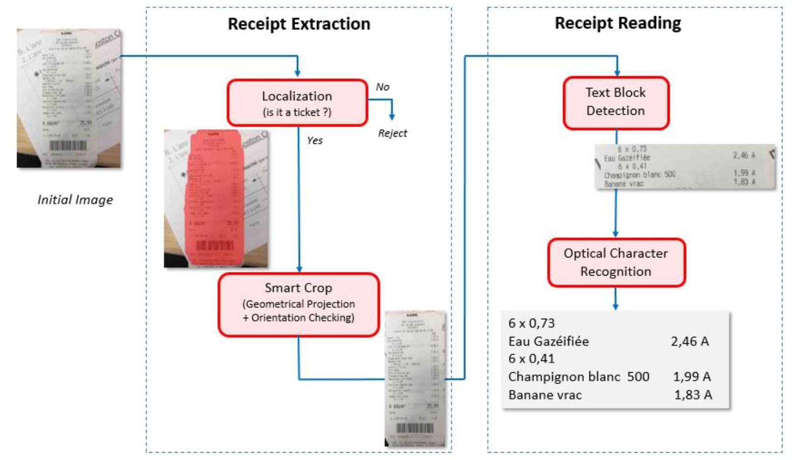

# Receipt automatic reader

## Olga Maslova, Louis Klein, Damien Dabernat, A Benoit, Patrick Lambert

[Browse](https://hal.archives-ouvertes.fr/hal-02196644/document)

```latex
maslowa2019receipt
```


### Pipeline

| Receipt detection | Receipt localization | Receipt normalization | Text line segmentation | Optical character recognition | Semantic analysis |
|:-----------------:|:--------------------:|:---------------------:|:----------------------:|:-----------------------------:|:-----------------:|
| ✔️                | ✔️                   | ✔️                    | ✔️                     | ❗                             | ❌                 |

#### Receipt detection & localization

* > Mask-RCNN detection and segmentation method
* ResNet-101 as backbone
* > Only the final layers were adjusted: the Region Proposal Network (RPN) and the segmentation mask heads of the network have been fine-tuned and the bounding box classifier head is modified to comply with our two class problem (receipt/non-receipt)
* Dice loss

#### Receipt normalization

* > First we extract the polygonal representation of the predicted receipt mask boundaries. We then approximate this polygon by a quadrilateral. Finally, a homography is computed to remove the perspective effect. This operation transforms the receipt quadrilateral into the closest straight vertical (or horizontal) and rectangular shaped receipt image and crops it out of the
  > initial image.
* OpenCV
* Using VGG-16, finding orientation of receipt is done (0, 90, 180 or 270 degrees).

#### Text line segmentation

* orientation correction
* > cropped images are resized to 512 pixel width
* > highlight the text-free areas that are likely to isolate distinct text region blocks. Sobel filters are applied to highlight character boundaries
* > An automatic thresholding that relies on the classical Otsu method is applied next in order to obtain a binary image mask
* > A morphological image closing is finally applied to merge neighboring text pixels together

#### Optical character recognition

- > Tesseract do not compete with commercial grade OCR systems from Cloud Providers
- Google Vision OCR

### Notes

* 

* > receipts are, to name a few, not standardized, often damaged before being captured (crumples, tear, etc.), captured in poor acquisition conditions (no vertical alignment, with perspective effect, poor light, etc.)

* data augmentation
  
  > horizontal flipping, scaling, small rotations around the vertical alignment of the receipt, shearing and translation
