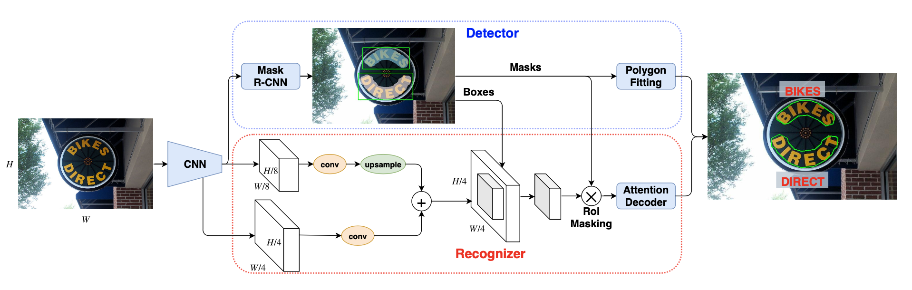

# Towards Unconstrained End-to-End Text Spotting

## Siyang Qin, Alessandro Bissacco, Michalis Raptis, Yasuhisa Fujii, Ying Xiao

[Browse](https://arxiv.org/pdf/1908.09231.pdf)

```latex
@article{qin2019towards,
   title={Towards Unconstrained End-to-End Text Spotting},
   ISBN={9781728148038},
   url={http://dx.doi.org/10.1109/ICCV.2019.00480},
   DOI={10.1109/iccv.2019.00480},
   journal={2019 IEEE/CVF International Conference on Computer Vision (ICCV)},
   publisher={IEEE},
   author={Qin, Siyang and Bissaco, Alessandro and Raptis, Michalis and Fujii, Yasuhisa and Xiao, Ying},
   year={2019},
   month={Oct}
}
```


### Pipeline

| Receipt detection | Receipt localization | Receipt normalization | Text line segmentation | Optical character recognition | Semantic analysis |
|:-----------------:|:--------------------:|:---------------------:|:----------------------:|:-----------------------------:|:-----------------:|
| ❌                 | ❌                    | ❌                     | ✔️                     | ✔️                            | ❌                 |

#### Text line segmentation

* > shape text detection as an instance segmentation problem
* > Mask R-CNN: for each text instance, it predicts an axis-aligned rectangular bounding box and the corresponding segmentation mask
* ResNet-50 and Inception-ResNet as backbones
* > RoI masking which multiplies the cropped features with text instance segmentation masks. This removes neighboring text and background, and ensures that the attention decoder will focus only on the current text
  > instance
* > each RoI is processed by three prediction heads: a class prediction head to decide if it is text or not, a bounding box regression head to predict an axis-aligned rectangular box, and finally a mask prediction head to predict the corresponding instance segmentation mask.

#### Optical character recognition

- > attention model is then used to decode the textual content of
  > each irregularly shaped text region without rectification
- > sequence-to-sequence (seq2seq) Bahdanau-style attention decoder
- > skip the feature rectification step between the detector and the recognizer
- > We identify feature rectification as a key bottleneck in generalizing to irregular shaped text, and introduce a simple technique (RoI masking) that makes rectification unnecessary for the recognizer. This allows the attention decoder to directly operate on arbitrarily shaped text instances

### Notes

* > end-to-end trainable network that can simultaneously detect and recognize text of arbitrary shape

  

* > an existing multi-step OCR engine can be leveraged as partially labeled training data

* > the recognizer requires far more data to train than the detector

* > 15 Tesla V100 GPUs are used

* > about three days to finish

* > we run an existing OCR engine on one million images with text and use the predictions (oriented rectangles and transcriptions) as the partially labeled ground-truth

* > To prevent the large volumes of synthetic and partially labeled data from dominating the training data, extensive data augmentations are applied to fully labeled real images
