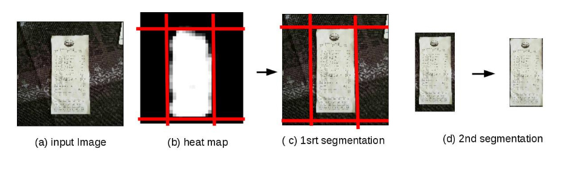
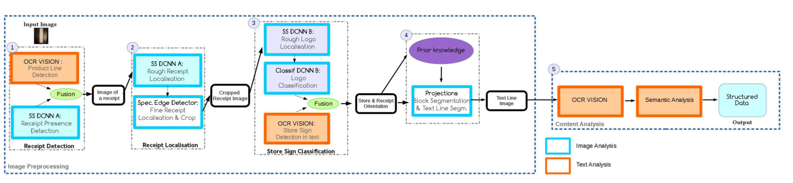

# Deep Learning for automatic sale receipt understanding

## Rizlene Raoui-Outach, Cecile Million-Rousseau , Alexandre Benoit and Patrick Lambert

[Browse](https://hal.archives-ouvertes.fr/hal-01654191/document)

```latex
@article{raoui2017deep,
author = {Raoui-Outach, Rizlène and Million-Rousseau, Cécile and Benoit, Alexandre and Lambert, Patrick},
year = {2017},
month = {12},
pages = {},
title = {Deep Learning for automatic sale receipt understanding}
}
```

### Pipeline

| Receipt detection | Receipt localization | Receipt normalization | Text line segmentation | Optical character recognition | Semantic analysis |
|:-----------------:|:--------------------:|:---------------------:|:----------------------:|:-----------------------------:|:-----------------:|
| ✔️                | ✔️                   | ✔️                    | ✔️                     | ❗                             | ❗                 |

#### Receipt detection

* > Receipt detection is necessary because users do not always follow the rules and upload blurred images to the servers, selfies, etc. that
  > must be detected not to fool our system.
* > Text analysis for receipt detection
* > Deep Learning analysis for receipt detection
  > 
  > Once the network has processed an image, the
  > resulting heat map consists in a gray level image where the
  > higher the pixel intensity, the greater the probability that
  > this pixel corresponds to a receipt.
* 

#### Receipt localization

* > The refined cropping method consists in the use of a
  > specifically designed contour detectors proposed in [https://hal.archives-ouvertes.fr/hal-01319960/document](https://hal.archives-ouvertes.fr/hal-01319960/document)
* > The basic principle of this receipt edge detector is to look
  > for regions with two main adjacent areas, a bright one
  > (the ticket border) and a darker one (the background), in
  > quasi vertical or horizontal position.
* 

#### Receipt normalization

* > This step is quite
  > easy as there is a good contrast between the characters
  > (dark pixels) and the background (bright pixels). So an
  > adaptive binarization is used.

#### Text line segmentation

* > Then blocks covering the
  > entire width of the receipt are extracted in a classical way
  > using horizontal pixel intensity projections. These blocks
  > are then divided into sub-blocks using vertical projections
  > in order to separate products labels and their prices for
  > example. Since the store sign is known, prior knowledge is
  > used to adapt block boundary splits. Finally, on each sub-
  > block, a text line segmentation is carried out before being
  > submitted to the OCR. It can be noted that the projection
  > approach may require a prior rotation of the receipt which can be easily performed as the receipt borders have already
  > been detected.

#### Optical character recognition

- Google Vision API

#### Semantic analysis

- Fields extracted:
  - item names
- > As said, this
  > block contains short item labels which are often vague
  > even for the consumer himself. No encoding standards
  > exist and they often differ from one store sign to another
  > and even between stores of the same brand for the same
  > product.
- > a dedicated product ontology has been built,
  > the most specific concept being products grouped into
  > product categories.
- > An algorithm dedicated to text semantic analysis was
  > then developed to associate a given short label from the
  > OCR extraction and the product concept in the ontology.
- > This work is still ongoing and is not detailed as it is out
  > of the scope of this paper.

### Notes

* > Indeed the life of a consumer receipt is highly subject to degrada-
  > tions such as crumples, tears and other physical damages
  > before being sub-optimally captured using a smartphone.

* 

* > For receipt pre-processing, Deep Convolutionnal Neural
  > Networks (DCNNs) are used at different steps and are of
  > two types : the first one is dedicated to classification while
  > the second one is dedicated to semantic segmentation.
  > However, the first layers of both networks rely on the same
  > architecture and learned weights. Only the last layers are
  > specialized for their specific tasks (transfer learning).

* There is store sign recognition:
  
  * > Indeed, as sale receipts are structured documents, once the store sign is known, one can use prior knowledge on the brand to better understand the receipt structure.
  * OCR
    * > The first criterion
      > is based on the store name. Having a homemade store
      > name database, a known store name is searched within the
      > decoded receipt text.
    * > The second criterion consists in identifying the presence
      > of a phone number using a regular expression. If detected,
      > this phone number is compared to the ones of a known
      > store brand phone number database.
    * > the third criterion is based on references to the
      > terminology of the sign. For each sign, the terminology
      > used in terms of slogan, loyalty program and brand dis-
      > tributor have been listed by the company.
  * DCNN:
    * > logos, all being rectangular with
      > the widest sides on the horizontal axis: the long ones and
      > the short ones
    * > One must also mention
      > that the two resize factors are chosen in order to ensure
      > that the sliding window generated by the SS DCNN will
      > contain, at least once, the full logo.
    * > the
      > long logos are more frequent, we first use the resize ratio
      > corresponding to this type of logos. If the semantic seg-
      > mentation network (SS DCNN B, step 2) does not detect
      > logo area, the second ratio factor is applied. Potential sign
      > areas are next cropped and classified by the ”C DCNN B”
    * > upper part of
      > receipt images. Only if no logo is detected, then the lower
      > part is processed

* If store sign not recognized,
  
  > automatic processing is too uncertain and
  > the related receipts are redirected to a human expert
  > analysis.

* > The 3000 receipts of the dataset have been processed to
  > detect the purchased products which amounts for more
  > than 87,000 short labels. Accurate association rate of
  > short-label and product-concept is 81,7 %.
