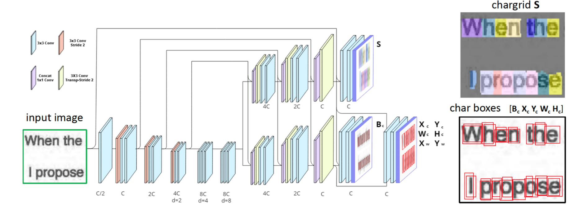
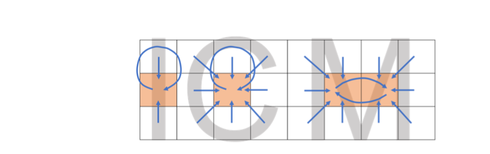
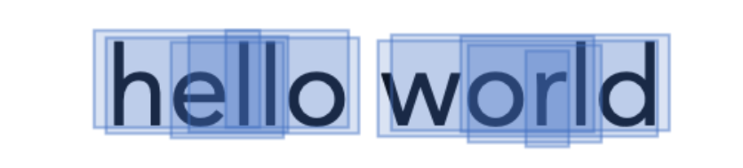

# Chargrid-OCR: End-to-end Trainable Optical Character Recognition for Printed Documents using Instance Segmentation

## Christian Reisswig, Anoop R Katti, Marco Spinaci, Johannes Höhne

[Browse](https://arxiv.org/pdf/1909.04469.pdf)

```latex
@misc{reisswig2019chargrid,
    title={Chargrid-OCR: End-to-end Trainable Optical Character Recognition for Printed Documents using Instance Segmentation},
    author={Christian Reisswig and Anoop R Katti and Marco Spinaci and Johannes Höhne},
    year={2019},
    eprint={1909.04469},
    archivePrefix={arXiv},
    primaryClass={cs.CV}
}
```


### Pipeline

| Receipt detection | Receipt localization | Receipt normalization | Text line segmentation | Optical character recognition | Semantic analysis |
|:-----------------:|:--------------------:|:---------------------:|:----------------------:|:-----------------------------:|:-----------------:|
| ❌                 | ❌                    | ❌                     | ❌                      | ✔️                            | ❌                 |

#### Optical character recognition

- > predicts a) a two-dimensional character grid (chargrid) representation of a
  > document image as a semantic segmentation task and b) character boxes for delineating character instances as an object detection task

- > document OCR as an instance semantic segmentation of the document image with characters as labels

- > we further use class agnostic object detection to predict bounding boxes for each character

- > predicting word centers at each pixel and clustering the characters based on the predicted word centers

- > The model is trained using categorical cross-entropy [3] for the segmentation outputs (S, Bc ) and using Huber loss [25] for the regression output (Xc, Yc, Wc, Hc, Xw, Yw)
  
  

- Post-processing:
  
  - Filtering character boxes efficiently
    
    - > In order to delete redundantly predicted box proposals of the same character instance, usually NMS is applied
    - > we introduce a preliminary step before NMS, which we call Graphcore
    - > We construct a directed graph where each vertex is a candidate pixel and we add a directed edge going from pixel A to pixel B if pixel A predicts pixel B as the center of its predicted character box.
    - > By taking the k-core of the resulting graph with k=1, only the loops in the graph are retained
    
    
  
  - Constructing word boxes from character boxes
    
    - > Each character makes a word box proposal (for the word it belongs to) based on the word centers predicted by the pixels inside the character; the proposal is such that it extends from the character itself to its reflection on the other side of the predicted word center.
    - > The word proposals, thus generated, significantly overlap for characters belonging to the same word and do not or marginally overlap otherwise. We wish to find clusters of characters whose word proposals significantly overlap.
    - > we build a graph where each character is a vertex and the edge between a pair of characters indicates whether their proposals significantly overlap, i.e. intersection is more than 50% of the smaller box. We then cluster the characters by finding connected components in this graph.
    
    

### Notes

* > end-to-end trainable approach for Optical Character Recognition (OCR) on printed documents
* > real financial documents, with noisy labels coming from the state-of-the-art
  > open source OCR solution, Tesseract v4
* > Typical steps of OCR include binarization, skew correction, layout analysis / line segmentation and text recognition.
* > a sequential OCR framework can suffer from the fact that errors in early processing steps can impact all following modules
* > 
