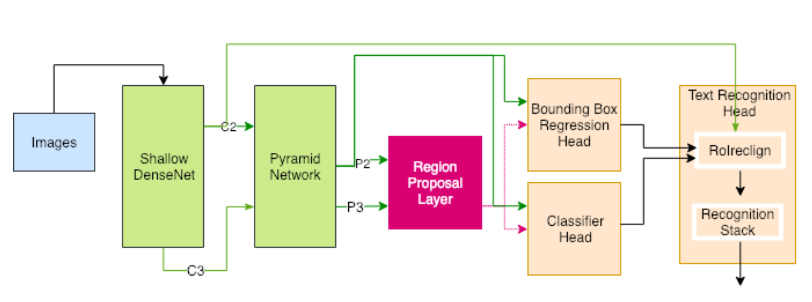

# A Multitask Network for Localization and Recognition of Text in Images

## Mohammad Reza Sarshogh, Keegan E. Hines

[Browse](https://arxiv.org/pdf/1906.09266.pdf)

### Pipeline

| Receipt detection | Receipt localization | Receipt normalization | Text line segmentation | Optical character recognition | Semantic analysis |
|:-----------------:|:--------------------:|:---------------------:|:----------------------:|:-----------------------------:|:-----------------:|
| ❌                 | ❌                    | ❌                     | ✔️                     | ✔️                            | ❌                 |

#### Text line segmentation

* > OCR comes from the large variety of aspect ratios inherent to blocks of text
* > We made changes to both the anchor boxes’ aspect ratios and the pooling dimensions of RoIAlign
* > predict not just spatial coordinates for a box’s center, width, and height (cx, cy, w, h), but additionally angle of rotation θ
* 

#### Optical character recognition

- > a convolutional mechanism with attention which outperforms more common recurrent architectures
  
  

- > main contributions of this paper is the added text recognition head

- > The TRN head consists of two main components: a new pooling mechanism tailored for text recognition (RoIRecognitionAlign), and an OCR stack

- > designed RoIreclign to pool the features of every RoI, no matter how big or small, from the second convolutional block of ResNet (C2)

- > we do not want our pooled representation to be corrupting text features by stretching short texts and compressing long ones

- CTC loss

### Notes

* 
* > after the convolutional backbone, feature pyramid and region proposal network, our model has three heads: a localizer (bounding box regression), an text classifier (text or background), and a text recognition network (TRN) head. For each candidate text-line in an image, our model outputs a
  > bounding box offset (width, height, center), a class label (text
  > or background), and predicted sequence of the text.
* Based on Mask R-CNN
* Backbone - DenseNet + Feature Pyramid Network
* > FPN constructs a top-down architecture that merges the strong
  > features of higher levels of the convolutional stack with the
  > lower ones
* trained on synthetic data
