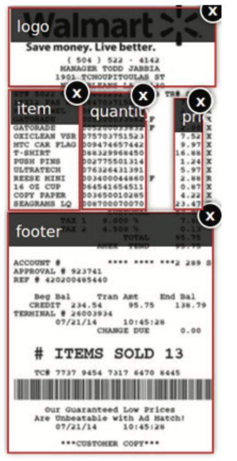
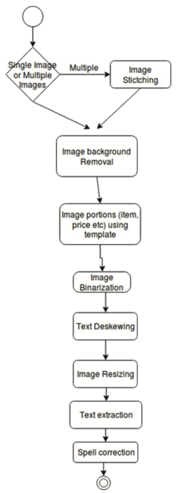

# Optical Character Recognition Engine to extract Food-items and Prices from Grocery Receipt Images via Templating and Dictionary-Traversal Technique

## Ali Sohani, Rafi Ullah, Faraz Ali, Athaul Rai,  Richard Messier

[Browse](http://kjcis.pafkiet.edu.pk/Doc/Vol2Issue1/Optical%20Character%20Recognition%20Engine%20to%20extract%20Food-items%20and%20Prices.pdf)

### Pipeline

| Receipt detection | Receipt localization | Receipt normalization | Text line segmentation | Optical character recognition | Semantic analysis |
|:-----------------:|:--------------------:|:---------------------:|:----------------------:|:-----------------------------:|:-----------------:|
| ❌                 | ✔️                   | ✔️                    | ❌                      | ❗                             | ✔️                |

#### Receipt localization

* Image Background Removal

#### Receipt normalization

* Otsu’s Image binarization

* Image and Text De-skewing

* Image Resizing

#### Optical character recognition

- Tesseract OCR Library

#### Semantic analysis

- Fields extracted:
  
  - item names,
  - item quantities,
  - item prices,

- > Section-level extraction

- > Our system then bifurcates the image into sections (like Price, Item-Names, Quantity are dealt separately from one another) according to given template layouts

- > We have used the stored templates of stores in database.
  >  And while testing the image, we retrieved that specific store template. Store template have the (x, y) coordinate points, width and height information.

- 

- > We had the location of items, prices and quantity in the template. We used this knowledge to retrieve image’s specific portion. 

- > Using above technique we retrieved the image portions/sections using template information independent of requested image size, whether greater or lesser than template image. 

- > Context sensitive spelling correction is a technique of correcting OCR results by matching them with dictionaries of stores.

- > store specific and grocery related dictionary

- > Words such as tax, total, subtotal, discount etc are included in that corpus. These words are excluded at the very first stage from OCR result.

### Notes

* Before localization, **Image stitching** is performed if more than one photo of receipt is available.
* 
