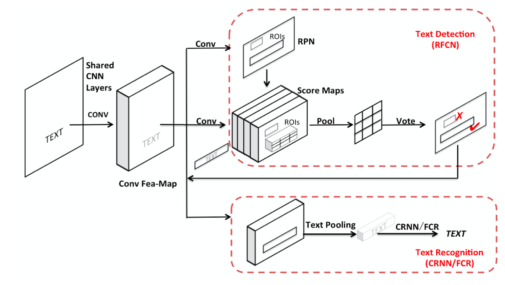

# A Novel Integrated Framework for Learning both Text Detection and Recognition

## Wanchen Sui, Qing Zhang, Jun Yang, Wei Chu

[Browse](https://arxiv.org/pdf/1811.08611.pdf)

```latex
@article{sui2018novel,
   title={A Novel Integrated Framework for Learning both Text Detection and Recognition},
   ISBN={9781538637883},
   url={http://dx.doi.org/10.1109/ICPR.2018.8545047},
   DOI={10.1109/icpr.2018.8545047},
   journal={2018 24th International Conference on Pattern Recognition (ICPR)},
   publisher={IEEE},
   author={Sui, Wanchen and Zhang, Qing and Yang, Jun and Chu, Wei},
   year={2018},
   month={Aug}
}
```


### Pipeline

| Receipt detection | Receipt localization | Receipt normalization | Text line segmentation | Optical character recognition | Semantic analysis |
|:-----------------:|:--------------------:|:---------------------:|:----------------------:|:-----------------------------:|:-----------------:|
| ❌                 | ❌                    | ❌                     | ✔️                     | ✔️                            | ❌                 |

#### Text line segmentation

* VGG-16 as backbone

* R-FCN (Region Fully Convolutional Network)
  
  > The detector returns the regions containing individual lines of text

* > a text line pooling layer similar to Region of Interest (RoI) pooling layer

* > these small text-line feature maps are sent to a text recognition network

* > the R-FCN network uses a Region Proposal Network (RPN) for extracting candidate regions, and ends with a position-sensitive RoI pooling layer for generating scores and refining coordinates for each proposal

* > At the bottom of the sub-network, a text pooling layer is designed to extract a fixed-height feature maps for individual text region

* > In this work, the detected text regions are horizontal rectangular bounding boxes.

#### Optical character recognition

- > the text regions are converted into fixed-height feature maps via a text pooling layer, and finally sent to a sequence recognizer to predict the corresponding text contents.
- Two schemas:
  - CRNN:
    - > a combination of Deep Convolutional Neural Networks (DCNN), Recurrent Neural Networks (RNN) layer and Connectionist Temporal Classification (CTC)
    - > Bidirectional Recurrent Neural Network (BiLSTM)
    - > translate the per-frame predictions into the final text sequence
  - FCR:
    - > applying several successive convolutional layers instead of the recurrent layers in CRNN. We denote the newly designed network as Fully Convolutional Recognizer (FCR)
    - > FCR, using a succession of convolutional layers in place of the BiLSTM layers in CRNN. Through combining R-FCN and FCR, our system can perform text detection and recognition via a single network that entirely consists of convolutional layers

### Notes

* > a single end-to-end trainable model and train the joint model for two tasks simultaneously
  
  

* no details on the predicted output (I assume anchor boxes + text for each anchor box)

* 
