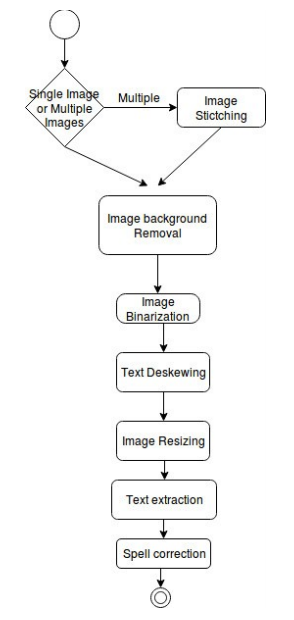

# OCR Engine to extract Food-items and Prices from Receipt Images via Pattern matching and heuristics approach

## Rafi Ullah, Ali Sohani, Faraz Ali, Athaul Rai

[Browse](https://www.researchgate.net/publication/322222389_OCR_Engine_to_extract_Food-items_and_Prices_from_Receipt_Images_via_Pattern_matching_and_heuristics_approach)

### Pipeline

| Receipt detection | Receipt localization | Receipt normalization | Text line segmentation | Optical character recognition | Semantic analysis |
| :---------------: | :------------------: | :-------------------: | :--------------------: | :---------------------------: | :---------------: |
|         ❌         |          ✔️           |           ✔️           |           ❌            |               ❗               |         ✔️         |

#### Receipt localization

* Image Background Removal

#### Receipt normalization

* Otsu’s Binarization

* Image de-skewing with https://www.pyimagesearch.com/2017/02/20/text-skew-correction-opencv-python/

* Image resizing

  > Image having DPI (Dots per Inch) greater than 300 has been observed good results.

  > bicubic interpolation

#### Optical character recognition

- Tesseract OCR Library

#### Semantic analysis

- Fields extracted:
  - item names,
  - item prices,
  - item quantities.
- Regular expressions for the pattern matching I-e item names, item prices and items quantities.
- Change due, walmart, total etc. words are removed.
- Words and line containing “constant words” such as total, discount, sub total etc. will be removed.
- Heuristics that if line contain item name and number (price and quantity), we consider those lines and discard rest of the lines. 
- But some of the receipts we observed, having different structure. Our heuristic is applied, but very weak over these kind of receipts. Items and prices on separate lines.

### Notes

* Before localization, **Image stitching** is performed if more than one photo of receipt is available.

* > Generic receipt parser.

* 