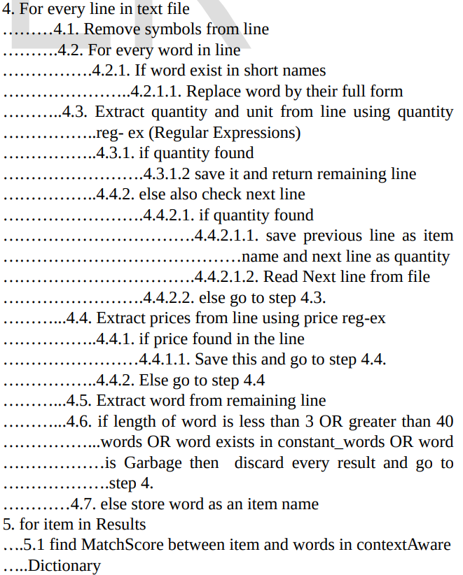
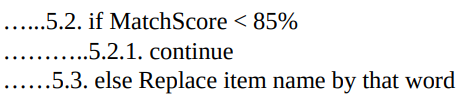

# OCR Engine to Extract Food-Items, Prices, Quantity, Units from Receipt Images, Heuristics Rules Based Approach

## Rafi Ullah, Ali Sohani, Athaul Rai, Faraz Ali, Richard Messier

[Browse](https://www.ijser.org/researchpaper/OCR-Engine-to-Extract-Food-Items-Prices-Quantity-Units-from-Receipt-Images-Heuristics-Rules-Based-Approach.pdf)

```latex
@unknown{ullah2018ocr,
author = {Ullah, Rafi and Sohani, Ali and Rai, Athaul and Ali, Faraz and Messier, Richard},
year = {2018},
month = {02},
pages = {},
title = {OCR Engine to Extract Food-Items, Prices, Quantity, Units from Receipt Images, Heuristics Rules Based Approach},
doi = {10.13140/RG.2.2.16640.74242}
}
```

### Pipeline

| Receipt detection | Receipt localization | Receipt normalization | Text line segmentation | Optical character recognition | Semantic analysis |
|:-----------------:|:--------------------:|:---------------------:|:----------------------:|:-----------------------------:|:-----------------:|
| ❌                 | ✔️                   | ✔️                    | ❌                      | ❗                             | ✔️                |

#### Receipt localization

* Image Background Removal with Canny edge detection

#### Receipt normalization

* Otsu’s Image binarization

* Image De-skewing

* Image Resizing
  
  > For large images we reduce size to 1/3rd ratios and increase DPI to 300 if less than 300 dpi.

#### Optical character recognition

- Tesseract OCR Library

#### Semantic analysis

- Fields extracted:
  
  - item names,
  - item quantities,
  - item prices,
  - units (in. e. grams, dozens, gm, kg, kilogram, kilo gram, spoon, piece)

- > It has been observed during our research that most of the grocery reciepts used short names instead of full names. For example reciept will be using “milk pdr” instead of “milk powder”. For mapping we have used a dictionary containing short names as keys and their full form. 

- > In most of the receipt it has been observed that item name, price and quantity is on single line. So we just parsed single line from text file (OCR result), extract price, quantity and item name from that line and ignore rest of the line. 

- > Some of the receipts has been observed that they have item name on one line and the item quantity or price on the next line. If price or quantity is not found in current line, then we read next line using, there may exist price or quantity or both. 

- > If numeric type is detected in string/line and the next word is some unit (We have store units) then it is treated as quantity. 

- > we have currencies symbols, if any numeric type is detected, and there is currency symbol before or after the numeric type, then it will be treated as price. 

- > Text detected by OCR will be garbage if length of word is less than 3 letters. For example “F” or “D” or “SC” etc are not valuable for us. 

- > Text detected by OCR will be garbage if length of word is greater than 40 or 50. Words detected such “xcasd.xxxxx.xxxx...xxxx3123.x”

- > If there 4 consective same letters or digits in a word it will garbage. Raaaafi etc.

- > Alpha numeric string having length greater than 5 digits will be considered as garbage. For example 4567889966 or 030222343424

- > If letters to numbers ratio in string /word is greater than 50%, word will treated as a garbage.

- Item, price and quanitity detected using regular expressions.

- Context Aware spell correction for item name.
  
  >  If match score of item name with dictionary word is less than 85%, we ignore word of dictionary and considered item name is correct and when the match score is greater than 85%, then item name is replace by dictionary word.

### Notes

* 
  
  
