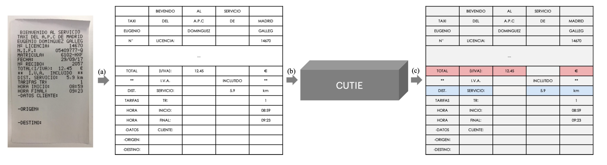

# CUTIE: Learning to Understand Documents with Convolutional Universal Text

## Xiaohui Zhao, Endi Niu, Zhuo Wu, and Xiaoguang Wang

[Browse](https://arxiv.org/pdf/1903.12363)

```latex
@unknown{zhao2019cutie,
author = {Zhao, Xiaohui and Wu, Zhuo and Wang, Xiaoguang},
year = {2019},
month = {03},
pages = {},
title = {CUTIE: Learning to Understand Documents with Convolutional Universal Text Information Extractor}
}
```

### Pipeline

| Receipt detection | Receipt localization | Receipt normalization | Text line segmentation | Optical character recognition | Semantic analysis |
|:-----------------:|:--------------------:|:---------------------:|:----------------------:|:-----------------------------:|:-----------------:|
| ❌                 | ❌                    | ❌                     | ❌                      | ❗                             | ✔️                |

#### Optical character recognition

- Manually collected receipts are OCRed with Google's OCR API
- > processed by an OCR engine to acquire the texts and their absolute /  relative positions

#### Semantic analysis

- Fields extracted:
  
  - merchant name,
  - merchant tax number,
  - date,
  - receipt id,
  - total price,
  - total price without tax,
  - tax price,
  - tax rate

- > Applies convolutional neural networks on gridded texts where texts are embedded as features with semantical connotations

- > involve the spatial information into the key information extraction process

- > by applying convolutional deep learning model on the gridded texts. The gridded texts are formed with the proposed grid positional mapping method, where the grid is generated with the principle that is preserving
  > texts relative spatial relationship in the original scanned document image.

- 

- > To generate the grid data, the goal of G is to map the texts from the original scanned document image to the target grid, such that the mapped grid preserves the original spatial relationship among texts yet more suitable to be used as the input for the convolutional neural network.

- > The model learns to generate the label for each text in the grid input via exploring both the spatial and semantic features. For that reason, the task of CUTIE bears resemblance to the semantic segmentation task in the computer vision field but with more sparse data distributions. Specifically, the mapped grid contains scattered data points (text tokens) in contrast to the images bespread with pixels.

- > CUTIE-A is a high capacity convolutional neural network that fuses multi-resolution features without losing high-resolution features, the proposed
  > CUTIE-B is a convolutional network with atrous convolution for enlarging the field of view and Atrous Spatial Pyramid Pooling (ASPP) module to capture multi-scale contexts.

- > a word embedding layer in the very beginning stage. Dropout is applied on the embedding layer to enhance the CUTIE’s generalization ability.

- ### Notes
* > 4,484 labelled receipts, without any pre-training or post-processing

* > To provide a fair comparison, 4, 484 samples with around 1, 500 each from Taxi, Meals Entertainment (ME), and Hotel, where 3, 375 samples are used for training and 1, 125 are used for testing
